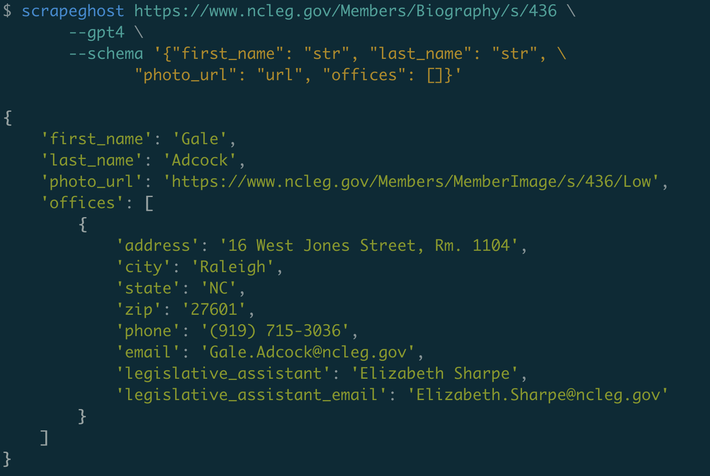

# scrapeghost

`scrapeghost` is an experimental library for scraping websites using OpenAI's GPT.

Source: [https://github.com/jamesturk/scrapeghost](https://github.com/jamesturk/scrapeghost)

Documentation: [https://jamesturk.github.io/scrapeghost/](https://jamesturk.github.io/scrapeghost/)

Issues: [https://github.com/jamesturk/scrapeghost/issues](https://github.com/jamesturk/scrapeghost/issues)

**Use at your own risk. This library makes considerably expensive calls ($0.36 for a GPT-4 call on a moderately sized page.) Cost estimates are based on the [OpenAI pricing page](https://beta.openai.com/pricing) and not guaranteed to be accurate.**

## Features

The purpose of this library is to provide a convenient interface for exploring web scraping with GPT.

While the bulk of the work is done by the GPT model, `scrapeghost` provides a number of features to make it easier to use.

**Python-based schema definition** - Define the shape of the data you want to extract as any Python object, with as much or little detail as you want.

**Preprocessing**

* **HTML cleaning** - Remove unnecessary HTML to reduce the size and cost of API requests.
* **CSS and XPath selectors** - Pre-filter HTML by writing a single CSS or XPath selector.
* **Auto-splitting** - Optionally split the HTML into multiple calls to the model, allowing for larger pages to be scraped.

**Postprocessing**

* **JSON validation** - Ensure that the response is valid JSON.  (With the option to kick it back to GPT for fixes if it's not.)
* **Schema validation** - Go a step further, use a [`pydantic`](https://pydantic-docs.helpmanual.io/) schema to validate the response.
* **Hallucination check** - Does the data in the response truly exist on the page?

**Cost Controls**

* Scrapers keep running totals of how many tokens have been sent and received, so costs can be tracked.
* Support for automatic fallbacks (e.g. use cost-saving GPT-3.5-Turbo by default, fall back to GPT-4 if needed.)
* Future versions will allow setting a budget and stopping the scraper if the budget is exceeded.